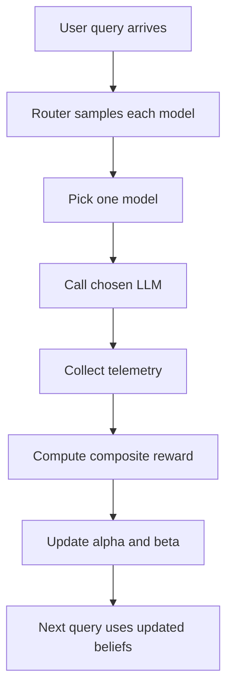

# DevConf Model Routing Talk Guide

## What This File Is

This is a prep guide for your DevConf.CZ talk:

**The 50% Cheaper Agent: Autonomous LLM Routing with Bayesian Bandits**

Use this as:

- a simple explanation of the idea
- a 30-minute speaking guide
- a slide planning document
- a demo script
- a reading list for deeper background

The code for the talk lives in:

- `model_routing/bayesian_router/router.py`
- `model_routing/bayesian_router/rewards.py`
- `model_routing/bayesian_router/simulator.py`
- `model_routing/examples/04_streamlit_demo.py`

## The Talk In One Sentence

Instead of sending every request to the most expensive LLM, we can use a Bayesian router that learns from production signals such as validity, latency, and retries, and gradually shifts traffic to cheaper models when it is safe to do so.

## The Talk In Very Simple Terms

Imagine you have three employees answering questions:

- one is very smart but very expensive
- one is cheaper and pretty good
- one is the cheapest and fast, but not always right

If you always ask the smartest one, quality stays high but the bill becomes huge.

If you always ask the cheapest one, the bill is low but quality can suffer.

So the real question is:

**How do we decide which model to use for each request?**

This talk says:

- do not hardcode that decision forever
- do not depend on humans to label every answer
- instead, let the system learn from signals it already has in production

Those signals are:

- Did the output parse correctly?
- Was the response fast enough?
- Did the agent need to retry or self-correct?

We combine those into one score, and use that score to teach the router which model is currently the best tradeoff between cost and quality.

## The Big Idea

The big idea is not just "route between models."

The real contribution is:

**Make routing work in production even when you do not have human labels.**

That is the gap between research and reality.

Academic papers often assume:

- every answer can be labeled as good or bad
- training data for the router already exists
- model quality is stable over time

Production reality is messier:

- nobody is manually rating every answer
- providers change models under the hood
- traffic changes over time
- you need safety guardrails before you send real traffic to cheaper models

Your talk is strong because it answers all of those production concerns.

## The Core Problem

Most teams using LLMs make one of these choices:

1. Always use the strongest model.
2. Hardcode simple rules like "use GPT-4 for everything important."
3. Manually pick one model and hope it stays good enough.

Why this breaks down:

- strongest model is expensive
- hardcoded rules go stale
- provider quality changes over time
- some tasks are much easier than others

The result:

- too much spend
- higher latency than necessary
- no systematic way to improve over time

## The Simple Story You Can Tell On Stage

You can explain the full talk using this story:

1. We have a cost problem.
2. Smaller models can answer a lot of requests correctly.
3. But we need a safe way to know when to trust them.
4. Research says "train a router using labels."
5. Production says "we do not have labels."
6. So we create a proxy reward from signals we already collect.
7. We use Thompson Sampling to keep balancing exploration and exploitation.
8. We add safeguards for cold start, drift, and failure.
9. Over time the router shifts more traffic to cheaper models.
10. We lower cost without meaningfully hurting quality.

If you keep returning to those ten points, the audience will follow you.

## Architecture In Plain English



What each step means:

- `User query arrives`: a normal inference request comes in
- `Router samples each model`: for each model, we draw a random sample from its current belief distribution
- `Pick one model`: the highest sample wins
- `Call chosen LLM`: send the request
- `Collect telemetry`: record validity, latency, retries
- `Compute composite reward`: turn those signals into one score
- `Update alpha and beta`: update our Bayesian belief about that model
- `Next query uses updated beliefs`: the router gets smarter over time

## What Thompson Sampling Means In Plain English

You do not need to explain Bayesian math deeply. Explain it like this:

> For each model, we keep a belief about how good it is. If a model has done well recently, the router becomes more confident in it. If it does poorly, confidence drops. On every request, we sample from each model's current belief and choose the one with the best sample. This naturally balances trying promising cheap models and falling back to safer expensive ones.

Even simpler:

- every model has a scorecard
- good outcomes push confidence up
- bad outcomes push confidence down
- we still occasionally explore
- over time, the better cost/quality models win more traffic

## How To Explain Beta Distributions Without Scaring People

You do not need equations first. Start with intuition:

- `alpha` means "evidence that this model succeeds"
- `beta` means "evidence that this model fails or underperforms"
- more data makes the belief curve narrower
- better models end up with distributions shifted to the right

Then if you want one simple formula, use this:

```text
confidence ~= alpha / (alpha + beta)
```

That is enough for most of the audience.

## What Makes Your Approach Different

Here is the "why this is interesting" section.

### 1. No human labels

The router learns from automatic signals:

- parse success
- latency
- retry or self-correction behavior

This is the main practical innovation.

### 2. Composite reward

Instead of asking "was this answer good?", you score the answer using a weighted function:

```text
reward = 0.50 * validity
       + 0.30 * latency_score
       + 0.20 * no_retry
```

In the current package:

- validity weight = 50%
- latency weight = 30%
- no-retry weight = 20%

This is implemented in `model_routing/bayesian_router/rewards.py`.

### 3. Cold start handling

The router does not start from total ignorance.

It uses expert priors:

- stronger expensive model starts with higher prior confidence
- cheaper models start lower, but still get explored

This avoids wasting the first 100 queries on blind experimentation.

### 4. Model rot handling

Providers change model behavior. A model that was good last week may become slower or worse today.

Your solution:

- apply decay to old evidence
- recent observations matter more than historical ones

This is implemented using:

- `gamma`
- `decay_interval`

in `model_routing/bayesian_router/router.py`.

### 5. Safety mechanisms

This is essential for enterprise audiences.

You are not saying:

> "Trust the cheap model and hope."

You are saying:

- keep exploring with exploration traffic, and describe stricter shadow evaluation as the production pattern
- use confidence-based fallback
- describe circuit-breaker-style guardrails as the hardened production extension

That makes the story much stronger.

## The Three Telemetry Signals

These are the three signals you should explain clearly.

### 1. Validity

Question:

> Did the output pass schema validation?

Why it matters:

- for structured tasks, parse success is a strong signal
- if the answer does not even parse, it is clearly unsafe to trust

Examples:

- JSON output parsed correctly
- Pydantic validation succeeded
- required keys were present

### 2. Latency

Question:

> Was the response fast enough?

Why it matters:

- cheaper models are often faster
- latency directly affects user experience
- latency is easy to measure in production

In the implementation, latency is converted into a score using a sigmoid curve instead of a hard cutoff.

Meaning:

- very fast responses get close to full latency credit
- very slow responses get penalized smoothly

### 3. Retry / self-correction

Question:

> Did the agent need another attempt to fix the answer?

Why it matters:

- if a model needs retries, its effective quality is lower
- retries also increase latency and cost

So "no retry needed" is treated as a positive signal.

## What The Router Actually Does

The router has two main operations:

### `select()`

For every model:

- sample from its Beta distribution
- pick the model with the highest sample

But with two practical twists:

- sometimes explore randomly with `shadow_rate` (this is exploration traffic, not a full hidden shadow-mirroring pipeline)
- if chosen model confidence is too low, fallback to the safer model

### `update()`

After the request:

- compute the composite reward
- add reward to `alpha`
- add `1 - reward` to `beta`
- periodically decay old evidence

That is the whole feedback loop.

## Why This Is Better Than Simple Rule-Based Routing

You should contrast your approach with naive routing.

### Naive rule-based routing

Example:

- "if prompt length < X, use cheap model"
- "if task type is support, use small model"
- "if user is premium, use large model"

Problems:

- rules become stale
- they do not adapt to provider drift
- they are brittle across domains

### Bayesian routing

Benefits:

- learns online
- adapts to non-stationary model behavior
- still explores
- keeps safety fallback

## What The Demo Shows

Your demo is in:

- `model_routing/examples/04_streamlit_demo.py`

It has three major parts:

### 1. Live Router

What it shows:

- traffic shifts over time
- model beliefs change
- cost curve diverges from the "always use GPT-4o" baseline
- reward components explain why the router changed behavior

What to say:

> At the beginning, the router is cautious. Over time, as it sees that the cheaper model is often valid, fast, and does not need retries, it starts shifting more traffic there.

### 2. Model Rot

What it shows:

- a model degrades partway through the simulation
- the router adapts
- traffic shifts away from the degraded model

What to say:

> This matters because provider quality is not fixed. The router cannot assume yesterday's best model is still today's best model.

### 3. Cold Start

What it shows:

- expert priors converge faster
- uniform priors explore too much early on

What to say:

> In production, the first 20 queries matter too. Cold start is not a theoretical edge case. It is what happens the day you deploy.

## 30-Minute Session Plan

Below is a practical structure for a 30-minute session.

### 0 to 3 min: Hook and problem

Goal:

- get attention quickly
- make the cost problem concrete

Say:

- many teams overpay because they send every request to the biggest model
- smaller models can handle a large portion of traffic
- the hard part is deciding safely when to use them

Good opening line:

> If you are using GPT-4 for every request, there is a good chance you are paying GPT-4 prices for problems a much smaller model could solve.

### 3 to 8 min: Why existing approaches are not enough

Goal:

- frame the gap between research and production

Say:

- research on routing is promising
- but many approaches assume human preference labels
- in production, those labels usually do not exist

Bridge:

> So the real question becomes: how do you build a learning router without labeled data?

### 8 to 15 min: Core method

Goal:

- explain the router itself

Cover:

- multi-armed bandit intuition
- Thompson Sampling intuition
- Beta distribution intuition
- composite reward from validity, latency, no-retry

Do not overdo the math.

One slide is enough for:

```text
reward = 0.50 * validity + 0.30 * latency + 0.20 * no_retry
```

One slide is enough for:

```text
confidence ~= alpha / (alpha + beta)
```

### 15 to 21 min: Production realities

Goal:

- show that this is not just a toy

Cover:

- cold start and expert priors
- model rot and decaying memory
- exploration traffic today, with shadow evaluation as the stricter production pattern
- confidence-based fallback
- circuit-breaker-style safety policies

This section is where enterprise audiences start trusting the design.

### 21 to 27 min: Live demo

Goal:

- make the learning visible

Suggested order:

1. Live Router tab
2. Model Rot tab
3. Cold Start tab

### 27 to 30 min: Summary and close

Goal:

- leave the audience with a clear takeaway

Close with:

- routing is not new
- label-free routing for production is the key contribution
- the point is not to replace the best model
- the point is to use the best model only when needed

Good closing line:

> The fastest way to reduce your LLM bill is not better procurement. It is better decision-making about when you actually need the expensive model.

## Suggested Slide Deck

This is a slide-by-slide plan.

### Slide 1: Title

- The 50% Cheaper Agent
- Autonomous LLM Routing with Bayesian Bandits

### Slide 2: The problem

- always using the strongest model is wasteful
- cost and latency go up
- quality does not always need to be maximal

### Slide 3: Why routing is hard

- some queries are easy
- some are hard
- labels are missing
- model quality changes over time

### Slide 4: Research landscape

- mention FrugalGPT
- mention RouteLLM
- explain where your approach differs

### Slide 5: Your idea

- Thompson Sampling
- composite reward
- no human labels

### Slide 6: How the router works

- select
- execute
- observe telemetry
- compute reward
- update beliefs

### Slide 7: Composite reward

- validity
- latency
- retry behavior

### Slide 8: Cold start

- expert priors vs uniform priors

### Slide 9: Model rot

- decay old evidence
- adapt to provider changes

### Slide 10: Safety

- exploration traffic / shadow-style evaluation
- fallback
- circuit-breaker-style guardrails

### Slide 11: Demo

- show the Streamlit app

### Slide 12: Results and takeaways

- cost reduction
- low quality impact
- production-friendly deployment pattern

## Demo Script

Use something close to this.

### Demo intro

> This demo simulates three models: one expensive and strong, two cheaper and weaker. The router starts with priors, explores a little, and then learns from production signals.

### Live Router tab

Point at:

- traffic distribution chart
- cost curve
- Beta distributions
- reward breakdown

Say:

- the green baseline is "always use the expensive model"
- the router curve drops below it as cheaper models pick up more traffic
- the belief distributions narrow as confidence increases

### Model Rot tab

Say:

- here we degrade one model in the middle of the run
- you can see traffic move away from it
- that is decaying memory doing its job

### Cold Start tab

Say:

- this compares expert priors vs uniform priors
- the expert prior version becomes useful faster
- that is important in production because you do not want a bad first day after deployment

## Simple Analogies You Can Use

If the audience looks confused, use one of these.

### Restaurant analogy

- expensive chef = strongest model
- line cook = cheaper model
- not every dish needs the head chef
- the manager learns who should prepare which kind of order

### Hospital triage analogy

- some cases need a specialist
- some cases can be handled by a general physician
- routing everyone to the specialist is expensive and slow

### Taxi dispatch analogy

- not every ride needs the premium car
- dispatch should learn what works for what route

## Likely Audience Questions

Here are likely questions and how to answer them.

### Q1. Why not just use a static complexity classifier?

Answer:

- you can, but it becomes stale
- model/provider performance changes
- Bayesian routing adapts online
- it also avoids hardcoded thresholds that may not generalize

### Q2. Are these proxy rewards really enough?

Answer:

- they are not perfect
- they are practical
- they work best when the task has observable signals like parsing and retries
- the goal is not perfect supervision, but useful online learning without expensive labels

### Q3. What if the cheapest model gives fluent but wrong answers?

Answer:

- that is why validity alone is not enough
- you need safety mechanisms
- for high-risk domains, add stronger validators and stricter fallbacks

### Q4. What kinds of tasks fit this best?

Answer:

- structured outputs
- tool-using agents
- retrieval-based tasks
- classification or extraction

Less ideal:

- highly creative open-ended writing
- tasks with weak automatic signals

### Q5. Why Thompson Sampling and not epsilon-greedy?

Answer:

- Thompson Sampling balances exploration and exploitation more naturally
- it uses uncertainty directly
- it usually explores more intelligently than flat random exploration

### Q6. How much data do you need before it starts working?

Answer:

- with expert priors, convergence can happen much faster
- in the demo, around 20 queries gives visible movement
- exact speed depends on task variability and reward quality

### Q7. How do you keep quality from degrading?

Answer:

- confidence floor
- fallback model
- exploration traffic and, in a hardened deployment, true shadow evaluation
- stricter circuit-breaker policies in production
- conservative priors at the beginning

## Things To Be Honest About

This improves credibility.

You should openly say:

- proxy rewards are approximations, not ground truth
- different tasks need different validators
- reward weights may need tuning by domain
- some tasks require stronger safety checks than this demo shows
- routing logic adds operational complexity, so the savings need to justify it

## Best Reading List

Below is a practical reading list with why each source matters.

### Read first

#### 1. FrugalGPT

Link:

- [FrugalGPT: How to Use Large Language Models While Reducing Cost and Improving Performance](https://arxiv.org/abs/2305.05176)

Why read it:

- one of the clearest papers on cost-aware LLM cascades
- gives you the broader framing: prompt adaptation, approximation, and cascades
- useful when someone asks where routing fits in the literature

What to take from it:

- routing/cascade is already a serious research direction
- cost differences across models can be huge
- intelligent orchestration matters, not just model quality

### 2. RouteLLM

Link:

- [RouteLLM: Learning to Route LLMs with Preference Data](https://arxiv.org/abs/2406.18665)

Why read it:

- closest research reference to your talk topic
- directly about routing between strong and weak models
- useful for explaining what existing literature assumes

What to take from it:

- routing can reduce cost significantly
- but it leans on preference data
- your contribution is solving the "no labels in production" problem

### 3. A Tutorial on Thompson Sampling

Links:

- [A Tutorial on Thompson Sampling (Stanford PDF)](https://web.stanford.edu/~bvr/pubs/TS_Tutorial.pdf)
- [arXiv HTML mirror](https://ar5iv.labs.arxiv.org/html/1707.02038)

Why read it:

- authoritative background on Thompson Sampling
- useful if you want to answer deeper questions confidently

What to take from it:

- Thompson Sampling is a principled exploration/exploitation method
- uncertainty is central, not an afterthought

## Good practical reads

### 4. Oren's Thompson Sampling explainer

Link:

- [Solving The Multi-Armed Bandit Problem with Thompson Sampling](https://oren0e.github.io/2020/04/27/mab_thompson/)

Why read it:

- much easier to digest than a full tutorial paper
- gives you good language for explaining the bandit problem to developers

What to take from it:

- use A/B testing vs multi-armed bandit contrast
- use the exploration/exploitation framing

### 5. Martin Fowler on Circuit Breaker

Link:

- [Circuit Breaker](https://martinfowler.com/bliki/CircuitBreaker.html)

Why read it:

- classic engineering reference
- great support for the safety/fallback part of your talk

What to take from it:

- failures cascade in distributed systems
- trip the breaker early instead of waiting for repeated bad outcomes
- "fail fast" is easier to explain than "advanced reliability pattern"

### 6. Shadow traffic testing

Link:

- [How to Validate New LLMs With Shadow Traffic and A/B Tests](https://www.codeant.ai/blogs/shadow-traffic-llm-testing)

Why read it:

- practical explanation of shadow testing
- useful when you explain how to evaluate new models without exposing users

What to take from it:

- mirror production requests
- hide shadow outputs from users
- compare quality, latency, and cost safely

### 7. Databricks on drift

Link:

- [Productionizing ML: Deployment to Drift](https://databricks.com/blog/2019/09/18/productionizing-machine-learning-from-deployment-to-drift-detection.html)

Why read it:

- useful for explaining drift to an engineering audience
- shows why deployed systems need monitoring, not just training

What to take from it:

- drift is normal in production
- monitoring plus feedback loops are necessary
- old success does not guarantee current success

## Recommended Reading Order

If you have limited time, do this:

### 60-minute version

1. Read `Model_Routing.md`
2. Read `model_routing/README.md`
3. Read FrugalGPT abstract and intro
4. Read RouteLLM abstract and intro
5. Read the Oren Thompson Sampling article
6. Open the Streamlit demo and practice the story

### 3-hour version

1. Everything above
2. Read `model_routing/bayesian_router/router.py`
3. Read `model_routing/bayesian_router/rewards.py`
4. Read the Thompson Sampling tutorial sections on intuition
5. Read Martin Fowler on circuit breakers
6. Read the shadow traffic article

## Useful Phrases For The Talk

Use these lines if you want crisp wording.

### Explaining the problem

- "Not every request deserves the most expensive model."
- "The cost problem is not model capability. It is model overuse."
- "Always using the best model is simple, but it is often financially lazy."

### Explaining the method

- "We replace missing labels with production telemetry."
- "The router is not trained offline once. It keeps learning online."
- "This is Bayesian decision-making driven by operational signals."

### Explaining safety

- "This is not blind cost cutting. It is cost optimization with guardrails."
- "We do not trust the cheap model unconditionally. We trust it when evidence supports it."

### Explaining the contribution

- "The contribution is not just routing. It is routing that survives production reality."

## One Possible Full Opening

You can use this almost as-is.

> Most LLM systems are overpaying. They route every request to the strongest model because it is the safest decision. But that means they are also paying the highest possible price for tasks a smaller model could often handle just fine. Research has shown that model routing can reduce cost, but most of that work assumes access to human preference labels. In production, those labels rarely exist. This talk is about how to build a router that still learns anyway.

## One Possible Full Closing

> The main idea I want you to leave with is simple: you do not need human labels to make routing work in production. If you have useful operational signals, a Bayesian router can learn when cheaper models are good enough, adapt when providers drift, and stay safe with fallback plus exploration traffic today, and stricter shadow evaluation in a hardened deployment. So if your LLM bill feels too high, the answer may not be a cheaper contract. It may be a smarter router.

## Final Checklist Before You Present

- Rehearse the talk once without slides
- Rehearse the demo once with a timer
- Be ready to explain Thompson Sampling without math
- Be ready to explain the composite reward in one sentence
- Be ready to answer "why not just use GPT-4 for everything?"
- Be ready to explain where the method could fail
- Keep the talk grounded in production, not theory

## Short Version You Can Memorize

If you get nervous, remember this:

- problem: always using the strongest model is too expensive
- challenge: research assumes labels, production does not have them
- method: use Thompson Sampling plus a composite reward from telemetry
- safeguards: expert priors, decay, exploration traffic, fallback, and stricter production safety policies
- outcome: lower cost, stable quality, practical deployment pattern

